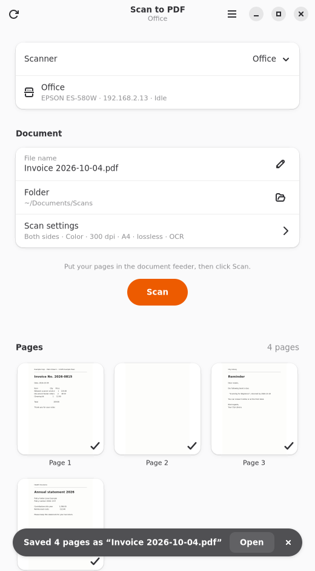
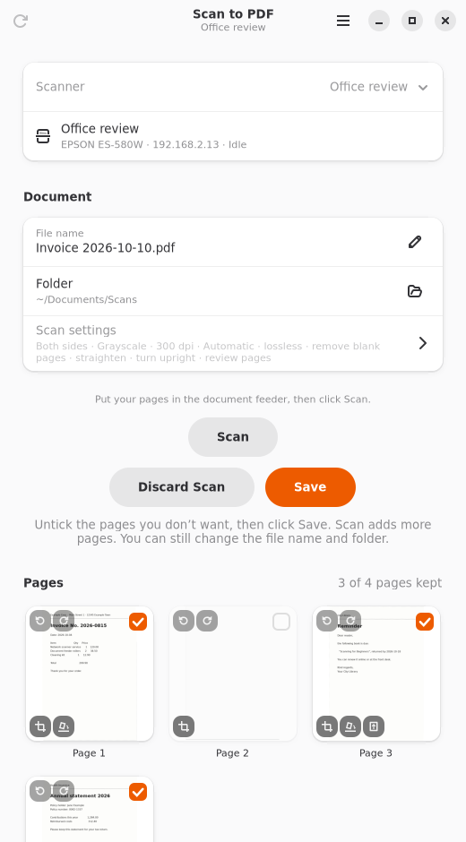
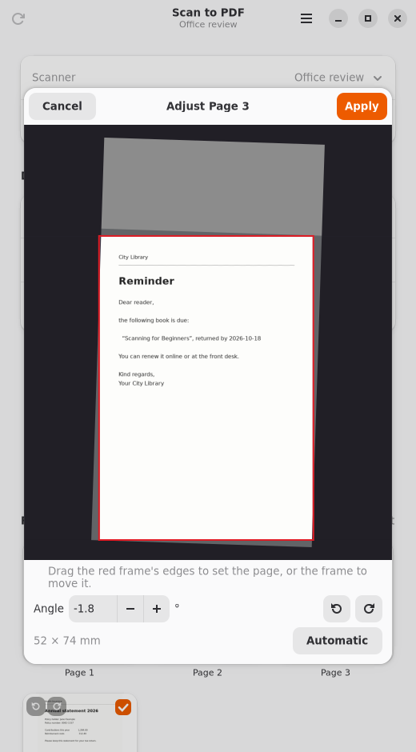
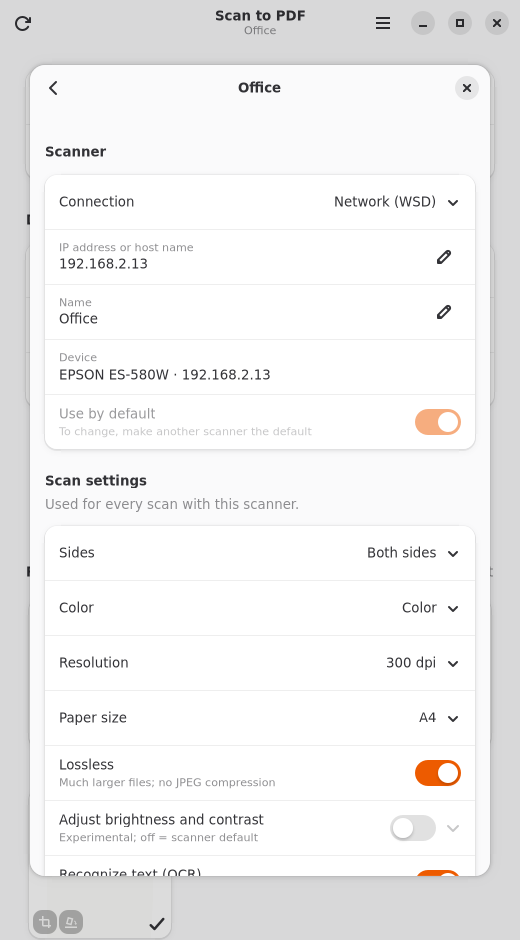

# wsdscan

Small CLI that scans from a network scanner and saves all pages from the document feeder as one PDF.

It works with any scanner that supports WSD (Microsoft's network scan protocol: WS-Discovery and WS-Scan, SOAP over HTTP) and has a document feeder. It was developed and tested with the **Epson ES-580W**, which has no eSCL/AirScan, so WSD is its only driverless option.

The tool talks to the scanner directly and writes the PDF itself. It needs only Python 3, with no SANE, `scanimage` or extra packages. WSD must be enabled on the scanner, usually in its web configuration.

Optionally it scans through [SANE](#sane) instead (`--backend sane`), e.g. for USB scanners, or to let the scanner cut and straighten the pages itself where its SANE backend offers that (the ES-580W does with `epsonds`).

Only standard WSD features are used. Everything model-dependent (resolutions, color modes, formats, duplex, paper size, brightness/contrast) is read from the scanner at run time.

## Setup

```sh
chmod +x wsdscan.py
export WSDSCAN_HOST=192.168.2.13     # or pass --host each time
./wsdscan.py --info              # capabilities and status
```

### Choosing a scanner

- **`--scanner NAME`** (or `WSDSCAN_SCANNER`): use a scanner configured in the [config file](#configuration-file), e.g. `--scanner Office`. Without it, the default scanner from the config file is used.
- **`--host <ip>`** (or `WSDSCAN_HOST`): use the scanner at that address.
- **Without a host**, the tool searches the network by multicast. If exactly one WSD scanner answers, it's used. If several answer, the tool lists them and asks you to choose with `--host` or `--model`. Multicast usually fails inside Docker containers with bridge networking, so set the host there.
- **`--model <text>`** (or `WSDSCAN_MODEL`): only use a scanner whose manufacturer or model name contains this text, case-insensitively, e.g. `--model ES-580W` or `--model epson`. Together with `--host`, it also checks that the scanner at that address is the expected one.
- **`--backend sane --device NAME`**: scan through SANE instead, see [SANE](#sane).
- **`--list`**: show the scanners found and exit:

```sh
./wsdscan.py --list
192.168.2.13     EPSON ES-580W  (firmware 13.SW19PB, service http://192.168.2.13:80/WDP/SCAN)
```

## Usage

```sh
./wsdscan.py                      # duplex, color, 300 dpi, A4 -> scan_<date>_<time>.pdf
./wsdscan.py invoice.pdf          # explicit file name
./wsdscan.py -s adf -m gray -r 100 letter.pdf
./wsdscan.py -m bw contract.pdf   # black & white: sharp text, small files
./wsdscan.py --lossless photo.pdf # color without JPEG compression
./wsdscan.py --brightness 200 --contrast 100 faint.pdf
./wsdscan.py --ocr letter.pdf         # searchable PDF (needs OCRmyPDF or Tesseract)
./wsdscan.py --skip-blank mixed.pdf   # leave out the empty backs of one-sided pages
./wsdscan.py -p auto --deskew --auto-rotate receipts.pdf  # any size, straight, upright
./wsdscan.py -p letter --outdir ~/Scans
./wsdscan.py -v                   # show the protocol steps
```

Defaults below are the built-in ones; the [config file](#configuration-file) can change them.

| Option | Default | Meaning |
|---|---|---|
| `--scanner` | `$WSDSCAN_SCANNER` / config | configured scanner to use (see [multiple scanners](#multiple-scanners)) |
| `--host` | `$WSDSCAN_HOST` | scanner IP; multicast discovery if unset |
| `--model` | `$WSDSCAN_MODEL` | only scanners whose manufacturer/model contains this text |
| `--outdir` | current directory | folder for the default file name |
| `-L/--list` | | list the scanners found, then exit |
| `-s/--source` | `duplex` | `adf` (one side) or `duplex` |
| `-m/--mode` | `color` | `color`, `gray` or `bw` (black & white, always lossless) |
| `-l/--lossless` | off | color/gray without JPEG compression (see below); `--no-lossless` turns a configured `lossless = true` off |
| `--brightness N` | scanner default | −1000 … 1000, or `default`; experimental |
| `--contrast N` | scanner default | −1000 … 1000, or `default`; experimental |
| `-r/--resolution` | `300` | dpi; checked against what the scanner reports |
| `-p/--paper` | `a4` | `auto`, `a4`, `a5`, `letter`, `legal`; `auto` cuts each page to its sheet (see below) |
| `-i/--info` | | print capabilities and status, then exit |
| `-c/--check` | | test mode: `--info` plus scanner-side validation of every setting combination; no scan |
| `--ocr` / `--no-ocr` | off | recognize text so the PDF is searchable (see below) |
| `--skip-blank` / `--no-skip-blank` | off | remove blank pages, e.g. empty backs in a duplex scan (see below) |
| `--crop` | `sides` | with `-p auto`: `sides` cuts only the sheet's left and right edges, `all` all four (see below) |
| `--deskew` / `--no-deskew` | off | straighten pages that were fed in crooked (see below) |
| `--auto-rotate` / `--no-auto-rotate` | off | turn pages that are sideways or upside down upright; needs Tesseract with orientation data |
| `--backend` | `wsd` | `wsd` (network, built in) or `sane` (through `scanimage`, see below) |
| `--device NAME` | the only one | with `--backend sane`: the SANE device, e.g. `epsonds:net:192.168.2.13` |
| `--hardware-corrections` / `--no-hardware-corrections` | on | with SANE: let the scanner cut (`-p auto`) and straighten (`--deskew`) pages itself, where its backend offers it |
| `--sane-options='…'` | | with SANE: further `scanimage` options, e.g. `--sane-options='--adf-justification-x=center'` |
| `--ocr-engine` | `auto` | `auto` (OCRmyPDF if installed, else Tesseract), `ocrmypdf`, `tesseract` |
| `--ocr-lang` | installed languages (see below) | Tesseract languages, e.g. `deu+eng` |
| `--show-config` | | show the config file location, the effective defaults and the installed OCR engines and languages |
| `-f/--force` | off | overwrite an existing output file |
| `-v/--verbose` | off | show the protocol steps (and the OCR command) |

The tool reads the sheets in the feeder until it's empty.

Exit codes:

| Code | Meaning |
|---|---|
| `0` | success |
| `1` | error; nothing was saved |
| `2` | the scan stopped partway (e.g. a paper jam); the pages scanned so far were saved |
| `3` | the scan was saved, but text recognition failed |

### Text recognition (OCR)

With `--ocr`, the tool adds an invisible text layer to the PDF, so you can search it and copy text from it. It needs one of these programs, which it detects automatically:

| Engine | Install (Debian/Ubuntu) | How it's used |
|---|---|---|
| [OCRmyPDF](https://ocrmypdf.readthedocs.io/) (preferred) | `sudo apt install ocrmypdf` | Runs on the finished PDF with `--output-type pdf`. The scanned images stay unchanged; no PDF/A conversion. |
| [Tesseract](https://tesseract-ocr.github.io/) | `sudo apt install tesseract-ocr` | Builds the searchable PDF directly from the scanned page images. |

Other distributions: Fedora `dnf install ocrmypdf` / `tesseract`, Arch `pacman -S ocrmypdf` / `tesseract`.

- **Languages:** by default, all installed Tesseract languages, with your system language and English first (e.g. `eng+deu` on an English desktop with `tesseract-ocr-deu` installed). With more than 4 installed (e.g. `tesseract-ocr-all`), only the system language and English are used, since every extra language makes recognition slower and less accurate. `--show-config` shows the installed languages and the automatic choice.
- **Changing the languages:** set `ocr_lang = deu+eng` in the config file (for all scanners in `[scan]`, or per scanner), choose them on a scanner's page in the desktop app's Preferences, or use `--ocr-lang` for a single run. An empty `ocr_lang` means automatic.
- **Checks before scanning:** if `--ocr` is requested but no engine or a requested language is missing, the tool stops before feeding any paper.
- **If text recognition fails after scanning:** the PDF is kept without text, a warning explains why, and the exit code is `3`.

### Blank pages

With `--skip-blank`, pages without content are left out of the PDF, e.g. the empty backs when a stack of one-sided and two-sided pages is scanned on both sides. The tool prints `page 4 is blank` for each one and the number removed at the end.

- **How it decides:** each page is reduced to the average brightness of 8 × 8 pixel blocks. It counts as blank if hardly any block is clearly darker than the paper. It ignores the outer 5 % at the top and bottom and 9 % at the sides (shadows, feeder marks, filing holes). Light show-through from the other side, colored paper and specks of dust still count as blank. A single text line, a page number or initials count as content (at 150 dpi and below, a lone page number may count as blank).
- **When in doubt, a page is kept:** pages it can't analyze (e.g. progressive JPEGs, which WSD scanners don't normally send) and pages with a lot of detail are never removed. If every page is blank, all are kept, with a warning.
- It needs no extra programs, and takes up to about a second per page at 300 dpi while the next page is being scanned.
- In the desktop app, blank pages start unticked in the review step, so you can keep them after all.

### Paper size, straightening and orientation

Many scanners can find the paper size themselves, but not over WSD (the ES-580W rejects it there), so this tool does it on the scanned image, for any scanner:

- **`--paper auto`** scans the scanner's whole scan area and cuts each page to its sheet: receipts, A5 and A4 can be mixed in one stack. The sheet is found because it is brighter than the feeder's backing (gray or black on most document feeders); a stretch of one color after the sheet (the ES-580W fills the rest of the length with white) is cut off too. With a white backing, or in black & white (where the backing turns white), the sheet can't be told apart: then the page keeps the full size.
- **`--crop sides`** (the default) cuts only the sheet's left and right edges. A sheet-fed scanner finds where a sheet starts and ends itself, so the page keeps the length as scanned (without the padding after it); nothing at the top or bottom is cut by guesswork. **`--crop all`** cuts all four edges to the sheet. A straightened page is always cut on all four: the scan's first and last lines are tilted against the straightened sheet and would leave wedges of feeder backing in the corners.
- **`--deskew`** straightens pages that were fed in crooked (up to 20°), from the sheet's edges. It needs the sheet's edges in the image, so it works best with `--paper auto`.
- **`--auto-rotate`** turns pages that are sideways or upside down upright. It uses Tesseract's orientation detection (packages `tesseract-ocr` and `tesseract-ocr-osd`), about a second per page while the next one is scanned. Pages with too little printed text, e.g. handwriting, stay as they are.
- **The scans themselves are not changed:** each image is embedded as the scanner sent it, and the PDF places, turns and cuts it to the page. Nothing is re-compressed, and the text from `--ocr` lines up with the corrected page.
- The tool prints what it did, e.g. `page 2: 105 x 148 mm, straightened by 3.4°, turned 180°`.
- In the desktop app, each page preview shows an icon per correction; in the review step a click switches it off or on again, and two buttons turn a page by 90° left or right by hand. A double click on a page opens an editor to set its edges and angle by hand.

### SANE

With `--backend sane`, the tool scans through SANE's `scanimage` command (`sudo apt install sane-utils`) instead of talking WSD itself. Everything after scanning stays the same: blank pages, paper size, straightening, orientation, OCR and the PDF.

```sh
./wsdscan.py --backend sane --list
epsonds:net:192.168.2.13         Epson ES-580W (ESC/I-2)
airscan:w0:ES-580W WSD           WSD ES-580W WSD (ip=192.168.2.13)
./wsdscan.py --backend sane --device epsonds:net:192.168.2.13 --info
./wsdscan.py --backend sane --device epsonds:net:192.168.2.13 -p auto --deskew stack.pdf
```

- **Why:** SANE reaches USB scanners and other protocols, and its backends know model-specific features. For the ES-580W, the `epsonds` backend (part of sane-backends) offers the scanner's own skew correction (`--adf-skew`), which the scanner refuses over WSD. It also lists the scanner's own cropping (`--adf-crp`), but switches it off as soon as `scanimage` sets the scan area, which `scanimage` always does; so this tool still cuts the pages itself. `--info` shows which of the two can be used.
- **Finding the scanner:** `--list --backend sane` shows what SANE finds (like `scanimage -L`). `epsonds` searches the network by itself; if it doesn't find your scanner, add `net 192.168.2.13` to `/etc/sane.d/epsonds.conf`. Without `--device`, the only scanner SANE finds is used.
- **Settings:** sides, color mode, resolution, scan area, brightness and contrast are mapped to the backend's options (`--info` shows how, and lists all its options). The backends name them differently, e.g. `ADF Duplex` or `Lineart`; settings the backend doesn't have are refused before scanning.
- **The scanner's own corrections** (on by default): with `--paper auto`, a backend that can cut pages to the sheet does so; with `--deskew`, one that can straighten does so. This tool then doesn't do it again. A scanner that only crops is not asked to with `--deskew`, since straightening here needs the sheet's edges. `--no-hardware-corrections` leaves both to this tool.
- **Further options** for the backend: `--sane-options='--adf-justification-x=center'`. Options this tool sets itself (device, source, mode, resolution, area, format, batch) are refused.
- **Pages** arrive as JPEG (or TIFF for black & white and lossless) one by one, so the app's preview and blank-page detection work as with WSD. Cancelling stops `scanimage` like Ctrl+C.
- `--check` is WSD-only; with SANE, use `--info`.

### Configuration file

`~/.config/wsdscan/config.ini` (or `$WSDSCAN_CONFIG`) sets your own defaults. The **Scan to PDF** desktop app edits it in its preferences, so settings made there also apply to this command. You can also edit it by hand:

```ini
[scan]
host = 192.168.2.13
mode = bw
resolution = 300
outdir = ~/Documents/Scans
filename = scan_{date}_{time}.pdf
```

See [Precedence](#precedence) below. `./wsdscan.py --show-config` shows the result, including the configured scanners.

#### Multiple scanners

Each `[scanner NAME]` section configures one scanner by `host` and/or `model`. It can also set its own defaults for any `[scan]` setting, e.g. black & white for one scanner or a different folder. `scanner =` in `[scan]` names the default:

```ini
[scan]
scanner = Office
mode = color

[scanner Office]
host = 192.168.2.13

[scanner Home]
model = ADS-1700W
mode = bw
outdir = ~/Documents/Home
```

```sh
./wsdscan.py letter.pdf                    # Office, color
./wsdscan.py --scanner Home letter.pdf     # Home, black & white, into ~/Documents/Home
./wsdscan.py --list                        # network scanners; configured ones are marked [Office]
```

#### Precedence

Highest first:
1. command-line options
2. environment variables (`WSDSCAN_SCANNER`, `WSDSCAN_HOST`, `WSDSCAN_MODEL`)
3. the selected `[scanner NAME]`
4. `[scan]`
5. built-in defaults

Without `scanner =`, the first configured scanner is the default, unless `[scan]` itself sets `host` or `model`, as in older config files. The desktop app manages this list in its Preferences and stores each scanner with all its settings. The same device can appear several times with different settings. The key `review_pages` belongs to the desktop app; this command ignores it. All keys are described in [gui/README.md](gui/README.md#settings). An invalid value stops the command with the file name and key in the message.

### Image quality and file size

| Mode | Transfer | In the PDF | Rough size per A4 page at 300 dpi (estimate) |
|---|---|---|---|
| `color`, `gray` (default) | JPEG from the scanner | embedded unchanged | a few hundred KB |
| `bw` | 1-bit uncompressed TIFF | 1-bit, zlib (lossless) | about 30–150 KB |
| `color --lossless` | 24-bit uncompressed TIFF (≈ 26 MB) | zlib (lossless) | several MB |
| `gray --lossless` | 8-bit uncompressed TIFF (≈ 9 MB) | zlib (lossless) | a few MB |

Some scanners use a fixed JPEG quality; the ES-580W's is fixed at 50 over WSD. Use `--lossless` when that isn't good enough, for example for photos or very fine print. For text documents, `bw` usually gives the sharpest result and the smallest files.

`--brightness` and `--contrast` are sent as WS-Scan exposure settings. Scanners usually say whether they support them but report no value range; the ES-580W, for example, doesn't. `--check` shows which values it accepts, but whether and how strongly the scanner applies them can only be seen in a test scan.

### Example: what the Epson ES-580W offers over WSD

Measured with `--info` (firmware 13.SW19PB):
- **Resolutions:** only 100 and 300 dpi (no 200 or 600, although the sensor is 600 dpi optical)
- **Color modes:** color, gray and black & white
- **Formats:** JPEG (`exif`, quality fixed at 50) and uncompressed TIFF
- **Paper size:** up to 8.5 × 15.5 in
- **Fixed settings:** automatic paper size off, rotation 0° only, scaling 100% only, content type "Text" only; a scan ticket asking for automatic paper size is rejected (use `--paper auto`, which works on the image)
- **End of a job:** at the full scan length (8.5 × 15.5 in, `--paper auto`) it ends the job with an empty image instead of the usual "no more images" answer; the tool treats that as the end

## Test mode

`--check` lists everything the scanner reports, including manufacturer, firmware, serial, status, active conditions (e.g. an empty feeder), formats, color modes, resolutions, optical resolution and paper sizes. Values the tool can't use are marked `(unused)`.

The validation table covers every source × mode × format (JPEG or lossless) × resolution the scanner reports. If the scanner reports brightness and contrast support, `--check` also probes which values (−1000, −500, 0, 500, 1000) it accepts. Finally it validates exactly the settings given on the command line, including `-m`, `--lossless`, `--brightness` and `--contrast`.

It also lists the optional WSD settings the scanner offers. Of these, the tool uses brightness and contrast:
- content type (text/photo)
- automatic paper size
- auto exposure, brightness and contrast
- JPEG quality range
- scaling and rotation

Anything else the scanner reports in that section, including vendor extensions, is listed under `other:`. "not reported" means the scanner didn't mention the setting. `--info` shows the same list without the validation step.

The validation uses WS-Scan's `ValidateScanTicket`: no paper is fed and no scan job is created.

```sh
./wsdscan.py --check                       # checks the defaults: duplex, color, 300 dpi, A4
./wsdscan.py --check -s adf -m bw -r 100   # checks specific settings
```

The final line says whether the chosen settings would work. The exit code is `0` if they're usable and `1` if not, so it also works as a health check from scripts or cron. If the scanner doesn't implement `ValidateScanTicket`, the table is skipped and the result is based on the reported capabilities alone.

## Tests

```sh
python3 -m unittest discover -s tests -v
```

Standard library only, about 40 seconds. The suite uses two fakes:
- `tests/fake_wsd.py`: a configurable fake WSD scanner (UDP discovery and SOAP over HTTP on ephemeral localhost ports).
- `tests/fake_ocr.py`: stand-ins for `ocrmypdf` and `tesseract`.
- `tests/fake_sane.py`: a stand-in for `scanimage`, with the real option lists of the ES-580W's `epsonds` and `airscan` backends.

It covers:
- unit tests for JPEG and TIFF parsing, PDF writing, SOAP fault and multipart parsing, ticket building and settings validation
- end-to-end runs of the CLI against the fake scanner:
  - duplex, one-sided, gray, black & white and lossless scans
  - brightness/contrast
  - an empty feeder, a busy scanner, a paper jam
  - an existing output file, unsupported settings
  - `--info`, `--check` and `--list`
- the config file: precedence, validation, saving, scanner profiles
- scanner discovery and `--model`
- progress reporting, cancelling, page selection
- text recognition: engine and language choice, failures, the per-page progress
- SANE (`test_sane.py`): option parsing and mapping, the scanner's own corrections, device lists, scans, an empty feeder, a jam, cancelling, files that are no pages
- security (`test_security.py`): pinned discovery, URL schemes, redirects, proxy, size, page and image limits, crafted TIFF/JPEG headers, device texts with control characters, safe file writing, invalid command-line values

The tests never read your real config file. The desktop app's tests are in `gui/tests`.

`ES580W_PROFILE` in the test file models the real device: `/WDP/SCAN` service path, only `exif`/`tiff` formats. When the real scanner surprises you, record the new behavior there or as a fake option and add a test.

## Security

WSD itself has no authentication: any device on your network can answer discovery and claim to be a scanner. The ES-580W serves WSD only over plain HTTP, so scan data travels unencrypted unless the network protects it (see [Securing the connection](#securing-the-connection)). The tool limits what a malicious or broken device can do:

- **Pinned addresses:** device URLs are only accepted if they point to the host that answered. With `--host`, only answers from that host count, and the first answer per device wins. A configured address can't be redirected to another machine by a second device.
- **Only HTTP and HTTPS:** no `file:`, `data:` or other URLs, no redirects. HTTP proxy settings (`http_proxy`) are ignored, so scans don't leave your network through a proxy.
- **Limits:**
  - 300 MB per response, with a deadline per request
  - 1000 pages and 2 GB per scan job
  - plausible image sizes only
  - only the image format that was requested
  - XML with a DTD is refused
- **Crafted images:** TIFF and JPEG headers are checked against the actual data before anything is allocated.
- **Clean output:** control characters, escape sequences and bidi overrides in device texts (model names, error messages) are replaced before they're shown.
- **Safe file writing:** a new PDF is written to a temporary file next to the target and then linked into place. An existing file, or a symlink planted in a shared folder, is never written through. With `--force`, the target itself is replaced, never the file a symlink points to.
- **OCR:** the OCR tools get absolute file paths and validated language codes, without a shell.

The desktop app shows device texts as plain text, never as markup. Its "open-file" action is reachable over D-Bus, so it only opens PDFs the app saved itself. `tests/test_security.py` covers these cases.

### Securing the connection

The scanner itself offers these protections, according to Epson's administrator guides for its network scanners. They are set up in its web configuration (`https://<scanner-ip>/`):

- **Admin password:** keeps others from changing the settings, including the ones below.
- **Protocols** (Services → Protocol): switch off what you don't use, e.g. Bonjour, SLP or LLTD. wsdscan only needs **WSD**.
- **IP filtering** (Network Security → IPsec/IP Filtering): refuse everything by default and allow only your computers. For wsdscan they need the services **WS-Discovery** (UDP 3702, only if you don't set the address) and **HTTP (Local)** (TCP 80, which carries WSD). This keeps other devices from scanning, but doesn't encrypt anything.
- **IPsec** (same page): encrypts all traffic between the scanner and your computers, with a pre-shared key or certificates. Epson recommends it against eavesdropping and tampering. On Linux, it's set up with strongSwan or libreswan in transport mode; wsdscan needs no changes. Discovery by multicast can't be protected this way, so set the scanner's address (`--host` or in the config). This combination hasn't been tested with wsdscan yet.
- **HTTPS:** the ES-580W serves only its web configuration over HTTPS, not WSD; `https://<scanner-ip>/WSD/DEVICE` answers 404. Other scanners may differ.

IEEE 802.1X, also supported by the scanner, authenticates the scanner to the network (e.g. an enterprise Wi-Fi), not users to the scanner. Epson's guides describe no per-user login for scanning.

## Protocol

1. WS-Discovery Probe (UDP 3702) returns the device URL, e.g. `http://<ip>:80/WSD/DEVICE`.
2. WS-Transfer `Get` on that URL returns the scanner service URL.
3. `GetScannerElements` returns capabilities and status.
4. `CreateScanJob` returns a job ID and token.
5. `RetrieveImage` is called repeatedly, returning one image per page side (JPEG, or TIFF for black & white and lossless; MTOM multipart), until the fault `ClientErrorNoImagesAvailable` says the feeder is empty.

## Desktop app

`gui/` contains **Scan to PDF**, a GTK 4 / libadwaita desktop app for GNOME, KDE Plasma and Ubuntu, built on this tool:
- **Scanners:** several scanners, each with its own settings, edited in its preferences.
- **During a scan:** page preview with a counter, optional removal of blank pages, an optional review step to remove pages before saving and OCR (and to scan more pages into the same document), and OCR progress per page.
- **Desktop integration:** a status bar icon, start at login, desktop notifications and the desktop's own file dialogs.

Install it with `gui/install.sh`, which also installs this tool as the `wsdscan` command. See [gui/README.md](gui/README.md).

| After a scan, with text recognition | Reviewing pages before saving | Adjusting a page | A scanner's settings |
|---|---|---|---|
|  |  |  |  |

## License

Copyright (C) 2026 Marcel Ritter

This program is free software: you can redistribute it and/or modify it under the terms of the GNU Affero General Public License as published by the Free Software Foundation, either version 3 of the License, or (at your option) any later version. See [LICENSE](LICENSE).
